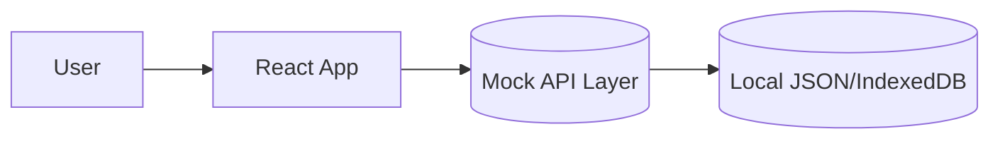

# 🚀 Sprint 2 계획서 — FleeCat 멀티테넌트 쇼핑몰 (구매자 My Account 고도화)

**기간 제안:** 2주 (10 영업일)

**목표:** 백엔드/DB 작업 없이 **프론트엔드 단독으로** 품질을 끌어올리기. 즉, **Mock API·상태관리·접근성·성능·테스트 자동화** 중심으로 **프로덕션에 가까운 사용자 경험** 확보.

> **결정사항(2025-10-08): 멀티테넌트 판별에 관한 JWT/RLS 내용은 스프린트 3(백엔드 협업 시)로 이월. 스프린트 2는 FE 단독 범위로 재정의.**

> **결정사항(2025-10-08): 멀티테넌트 판별은 _JWT 클레임(app_metadata.tenant_id)_ 기반으로 확정.**
> - 모든 RLS/쿼리/체크리스트는 JWT 클레임 기준으로 업데이트됨.
> - 가입/초대 직후 `app_metadata.tenant_id` 주입 + 세션 리프레시 필수.

---

## 1) 범위 (Scope)

### Must (이번 스프린트 내 필수)
- **Mock API 계층** 구축: `services/*` + 타입/스키마(Zod) + 지연·에러 시뮬레이터
- **상태관리 표준화**: React Query(또는 경량 캐시 훅) + RHF + Zod 통합
- **Orders 서버유사 페이징/필터 시뮬레이션**: limit/offset, 날짜/상태 필터 동작(클라이언트/Mock)
- **에러/로딩/빈 상태 컴포넌트** 3종 도입 및 전 화면 적용
- **접근성(a11y) 고도화**: 모달 포커스 트랩, 키보드 내비, aria-* 라벨 정비
- **성능 최적화**: 라우트 코드 스플리팅, 이미지 최적화, 리스트 가상화(옵션)
- **테스트 자동화**: 유닛(Jest/RTL) + e2e(Playwright + MSW)

### Should (가급적 이번에)
- **디자인 토큰**/다크모드 토글, 테마 스위처
- Orders **CSV 내보내기**(클라 생성), **프린트용 인보이스**(OrderDetail)
- **DateRangePicker** 공통 컴포넌트(기간 필터 표준화)
- **국/영 i18n 스텁**(ko 기본)

### Could (여건되면)
- 주문 카드 뷰 ↔ 테이블 뷰 토글
- 무한스크롤 옵션(페이지네이션과 토글 가능)
- 최근 본 상품/추천 영역 자리만들기(기능 플래그)

---

## 2) 아키텍처 개요

- **FE만 사용**: React 19 + Vite, React Router v7, RHF + Zod, React Hot Toast
- **Mock/데이터 계층**: `MSW(Mock Service Worker)` 또는 `fetch 인터셉터`로 API 흉내 + 지연/에러 주입
- **상태/데이터 패턴**:
  - 조회: React Query(`useQuery`)로 캐시/리트라이/로딩 일관화
  - 변경: `useMutation` + Optimistic UI + 실패 롤백(토스트)
- **로컬 지속성**: `localStorage`/`IndexedDB`를 선택적으로 사용(오프라인 느낌 제공)



---

## 3) 데이터 스키마 (Mock 기준)

> 실제 백엔드 Prisma 스키마와 일치하도록 구성하여 **교체 비용 최소화**

### Core Tables (실제 백엔드 스키마 기반)

- **member**:
  ```typescript
  {
    member_id: bigint,
    company_id: bigint | null,
    member_email: string,
    member_password: string | null,  // nullable (OAuth users may not have password)
    member_name: string,
    member_nickname: string,
    member_phone: string | null,
    member_account_type: string,  // 'individual' | 'business'
    member_account_role: string,  // 'buyer' | 'seller' | 'admin'
    member_status: string,         // 'active' | 'suspended' | 'inactive'
    member_marketing_email: boolean,
    member_marketing_sms: boolean,
    member_last_login_at: Date | null,  // timestamp without time zone
    member_created_at: Date,  // timestamp without time zone
    member_updated_at: Date   // timestamp without time zone
  }
  ```

- **member_address**:
  ```typescript
  {
    member_address_id: bigint,
    member_id: bigint,
    member_address_alias: string,           // 배송지 별칭 (예: '집', '회사')
    member_address_is_default: boolean,
    member_address_recipient: string,
    member_address_phone: string,
    member_address_zipcode: string,
    member_address_address1: string,
    member_address_address2: string | null,
    member_address_last_used_at: Date | null,  // timestamp without time zone
    member_address_status: string,          // 'active' | 'inactive'
    member_address_created_at: Date,  // timestamp without time zone
    member_address_updated_at: Date   // timestamp without time zone
  }
  ```

- **order**:
  ```typescript
  {
    order_id: bigint,
    member_id: bigint,
    shopping_cart_id: bigint | null,
    coupon_id: bigint | null,
    order_number: string,                   // UNIQUE 주문번호
    order_total_amount: number,             // numeric/decimal type
    order_discount_amount: number,          // numeric/decimal type (default: 0.00)
    order_subtotal_amount: number,          // 최종 결제액 (numeric/decimal type)
    order_status: string,                   // 'pending' | 'preparing' | 'shipped' | 'delivered' | 'cancelled' | 'refunded'
    order_recipient_name: string,
    order_recipient_phone: string,
    order_recipient_address: string,
    order_message: string | null,
    order_created_at: Date,  // timestamp without time zone
    order_updated_at: Date   // timestamp without time zone
  }
  ```

- **payment**:
  ```typescript
  {
    payment_id: bigint,
    order_id: bigint,                       // UNIQUE (1:1 관계)
    payment_method: string,                 // 'card' | 'bank' | 'virtual_account' | 'mobile'
    payment_amount: number,                 // numeric/decimal type
    payment_discount_amount: number,        // numeric/decimal type (default: 0.00)
    payment_status: string,                 // 'pending' | 'completed' | 'failed' | 'cancelled' | 'refunded'
    payment_transaction_id: string | null,  // PG사 거래ID
    payment_pg_name: string | null,         // PG사명
    payment_approved_at: Date | null,       // timestamp without time zone
    payment_cancelled_at: Date | null,      // timestamp without time zone
    payment_created_at: Date,  // timestamp without time zone
    payment_updated_at: Date   // timestamp without time zone
  }
  ```

### Mock-Only Tables (프론트엔드 시뮬레이션용)

> 백엔드에 없는 테이블은 Mock 전용으로 간소화 구현

- **order_items** (Mock 전용 - 백엔드 미구현):
  ```typescript
  {
    order_item_id: bigint,
    order_id: bigint,
    product_id: bigint,
    product_name: string,
    product_price: number,        // numeric/decimal type
    order_item_quantity: number,
    order_item_subtotal: number   // numeric/decimal type
  }
  ```

- **member_withdrawal_request** (Mock 전용 - 탈퇴 시뮬레이션):
  ```typescript
  {
    withdrawal_request_id: bigint,
    member_id: bigint,
    withdrawal_reason: string,
    withdrawal_detail: string | null,
    withdrawal_confirmed: boolean,
    withdrawal_created_at: Date  // timestamp without time zone
  }
  ```

> **Zod 스키마** + **시드(Mock JSON)** + **랜덤 지연/에러 플래그**로 서버 유사 행동 구현.
> 실제 백엔드 연동 시 Mock Layer만 교체하면 됨.

---

## 4) 백엔드 의존 기능 이월 안내

- RLS/JWT/Edge Functions 등 **서버 보안 항목은 스프린트 3**로 이월합니다.
- 본 스프린트에서는 동일 동작을 **Mock Layer**에서만 시뮬레이션합니다(테넌트 가드 UI 표기 등).

---

## 5) FE 작업 항목 (파일 레벨 To‑Do)

### A. 공통 인프라
- `src/services/http.ts`: 공통 fetch 래퍼(지연/에러 주입, 응답 파서)
- `src/services/msw/handlers.ts`: 엔드포인트별 핸들러 (member, address, orders...)
- `src/services/__mocks__/*.json`: 시드 데이터
- `src/lib/query.ts`: React Query 클라이언트, 에러 바운더리

### B. Profile/*
- RHF + Zod 유효성(이름 2~20, 전화 포맷, 변경 금지 필드 표시)
- 수정/저장 흐름(Optimistic) + 토스트 + 재검증

### C. Address/*
- CRUD 전 경로(추가/수정/삭제/기본설정) 모달 UX 정비
- 다음 우편번호 → 필드 매핑 유틸 `mapPostcodeResult()`
- 기본 주소 단일성 보장(클라에서 가드 + 경고 토스트)

### D. Orders/*
- 리스트 성능: 가상화(옵션, 50+건 시), Skeleton, Empty
- 기간/상태 필터: DateRangePicker, StatusChips(전체/결제완료/배송중/완료/취소환불)
- 페이지네이션(5개) + CSV 내보내기 + 프린트 보기
- 상세 모달: 상품 목록/배송지/결제/타임라인(시각적 개선)

### E. Settings/*
- 비밀번호 변경/탈퇴는 **UI만 유지**(Mock 처리). 실제 제출 시 안내 모달
- 탈퇴 사유 선택 → 로컬 기록(Analytics stub)

### F. 공통 컴포넌트
- `ErrorState`, `EmptyState`, `SkeletonList` 추가 및 전 화면 적용
- `DateRangePicker`, `StatusChip`, `Badge` 시스템화

### G. 라우팅/권한
- `/account/*` 경로 가드(미로그인 상태 시 Mock 로그인 화면 연결)
- 역할 전환 UI 유지(판매자 탭은 Placeholder)

---

## 6) Mock 동작 시나리오 (Edge 대체)
- 기본 배송지 설정: 기존 기본 해제 → 신규 기본 지정(클라 트랜잭션 시뮬)
- 오류 시나리오: 네트워크 에러, 500, 404, 유효성 실패 등 **확률 주입**
- 지연(loading) 시나리오: 300~1200ms 랜덤 딜레이로 UX/스켈레톤 검증

---

## 7) 테스트 전략

### 단위(Unit)
- Button/Input/Spinner/DateRangePicker/StatusChip
- 유틸: `mapPostcodeResult`, 전화번호 포맷터, CSV 생성기

### 통합(Integration)
- Orders 필터 → 쿼리 파라미터 → Mock 응답 → 렌더링(빈/로딩/에러 포함)
- Address 기본설정 플로우(단일성 보장, 되돌리기)

### e2e (Playwright + MSW)
- Mock 로그인 → Profile 수정/저장 → Address 추가/기본설정 → Orders 필터/2페이지 이동 → CSV 저장/프린트 미리보기 → Settings 안내 모달

### 접근성(a11y)
- 키보드 내비, 포커스 트랩(모달), aria‑label/role, 대비 체크

---

## 8) 성능 & UX 기준
- 초기 로드 TTI < 3.0s, 번들 < 250KB(gzip) 목표(코드 스플리팅, 아이콘 트리셰이킹)
- 리스트 가상화(Orders 50+건 시 자동 전환)
- 이미지는 `loading="lazy"` + 썸네일 크기 제한
- 모달/폼 제출 150ms 피드백(Toast/Spinner)

---

## 9) 분석/로그
- `track(event, payload)` 래퍼만 도입(실연동은 보류):
  - 로그인, 프로필 저장, 주소 추가/수정/삭제/기본설정, 주문상세 열람, CSV 내보내기, 프린트 클릭, 탈퇴 시도
- 콘솔/메모리 저장 또는 `localStorage`에 이벤트 적재(개발용)

---

## 10) 일정(제안, 10일)

**Day 1**: MSW/서비스 레이어 셋업, 에러/지연 인프라, Query 클라이언트

**Day 2**: 공통 상태/토스트/에러바운더리, a11y 베이스(포커스 트랩)

**Day 3**: Profile 실동작(Mock) + RHF/Zod 정착

**Day 4**: Address CRUD UX + 기본설정 단일성 가드

**Day 5**: Orders 페이징/필터/상세 + Skeleton/Empty

**Day 6**: Orders CSV 내보내기 + 프린트 뷰

**Day 7**: 디자인 토큰/다크모드 + DateRangePicker/StatusChip

**Day 8**: e2e 시나리오 작성/구현(Playwright)

**Day 9**: 성능 최적화(코드 분할/가상화) + 버그픽스

**Day 10**: 회귀 테스트, 데모 스크립트, 문서화

---

## 11) Definition of Ready / Done

**DoR**
- Mock 스키마/핸들러 정의 완료
- 화면별 에러/로딩/빈 상태 UX 시나리오 명세
- 테스트 대상/측정 지표(TTI/번들) 합의

**DoD**
- 모든 화면이 Mock 기반으로 사용자 흐름 완료 가능
- 에러/로딩/빈 상태가 일관되게 동작
- 유닛/통합/e2e 테스트 통과
- 성능 지표 달성(TTI/번들)
- 데모 스크립트/릴리즈 노트 배포

---

## 12) 위험 요소 & 대응
- **실서버 전환 시 갭**: API 계약서 부재 → 이번 스프린트에서 **타입/스키마 계약(Zod)** 확정
- **리스트 성능 저하**: 가상화 조건 스위치 + 스켈레톤 최적화
- **Mock 과신**: 네트워크 에러/지연을 확률 주입하여 현실성 확보

---

## 13) 작업 체크리스트
- [ ] MSW/서비스 레이어/시드 데이터 준비
- [ ] React Query/RHF/Zod 통합
- [ ] Error/Empty/Skeleton 컴포넌트 적용(전 화면)
- [ ] Profile Mock 저장 흐름
- [ ] Address CRUD + 기본설정 가드
- [ ] Orders 페이징/필터/상세
- [ ] Orders CSV/프린트
- [ ] 디자인 토큰/다크모드/공통 컴포넌트 확장
- [ ] 유닛/통합/e2e + a11y
- [ ] 성능 최적화 + 릴리즈 노트/데모 스크립트

---

## 14) 오픈 이슈 (결정 필요)
1. Mock 도구: **MSW** vs 간단 fetch 인터셉터(개발 편의성/테스트 연계성 고려)
2. 상태 관리: **React Query** 표준화 vs 경량 커스텀 훅(의존성 최소화)
3. Orders 목록 뷰: 카드/테이블 **토글 도입 여부**

---

## 15) 데모 스크립트 (리뷰용)
1) Mock 로그인 → `/account`
2) Profile 수정/저장(토스트) → 새로고침 후 Mock 재적재
3) Address 추가 → 기본 설정(단일성 가드) → 수정 → 삭제
4) Orders 3개월+배송중 필터 → 2페이지 이동 → 상세 모달 → CSV 내보내기/프린트
5) Settings 비번 변경/탈퇴 버튼 → 안내 모달(Mock 알림)
6) 다크모드 토글/DateRangePicker/StatusChip 동작 확인

---
