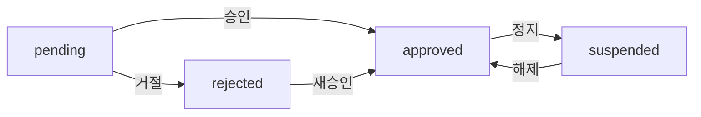

# Step 3: AdminTenant Repository 생성

> **작성일**: 2025년 10월 7일
> **상태**: ✅ 완료
> **파일**: `src/repositories/admin/adminTenant.repository.js`

---

## 📚 개념 설명

### 🎯 왜 필요한가?

FleeCat은 **다중 판매사(Multi-tenant) 플랫폼**입니다. 여러 공방(판매사)이 각자의 상품을 등록하고 판매할 수 있는 구조이며, 관리자는 이들을 관리해야 합니다:

- **신규 판매사 승인 프로세스** (입점 신청 → 검토 → 승인/거절)
- **판매사 목록 관리** (전체 조회, 상태별 필터링, 검색)
- **판매사 상태 변경** (활성화, 정지, 재승인)
- **판매사 통계** (총 판매사 수, 승인 대기 수, 상태별 분포)

### 💡 일반 Tenant vs Admin Tenant

**기존 `tenant.repository.js`** (일반 사용자용):
```javascript
// 활성화된 판매사만 조회
findAll({ where: { tenant_status: 'approved' } })
findById(tenantId)  // 기본 정보만
```

**새로운 `admin/adminTenant.repository.js`**:
```javascript
// 관리자 전용 - 모든 판매사 관리
findAll({ page, limit, status, search })  // 모든 상태 조회 가능
findByIdWithDetails(tenantId)             // 상세 정보 + 소속 회원
approve(tenantId, approvalData)           // 승인 처리
reject(tenantId, rejectReason)            // 거절 처리
updateStatus(tenantId, status)            // 상태 변경
getStatistics()                           // 통계
```

---

## 🔑 핵심 개념

### 1. 판매사(Tenant) 구조

**테이블 관계**:
```
tenant (기본 정보)              tenant_detail (상세 정보)
├── tenant_id                 ├── tenant_id (FK, 1:1)
├── tenant_name               ├── business_number
├── tenant_status             ├── bank_account
├── tenant_created_at         ├── approved_at
└── tenant_updated_at         ├── rejected_at
                              ├── admin_memo
                              └── reject_reason
```

**CASCADE 삭제**:
- tenant 삭제 → tenant_detail 자동 삭제
- tenant_member, product는 별도 처리 필요

---

### 2. 판매사 상태(tenant_status)

| 상태 | 의미 | 설명 |
|------|------|------|
| `pending` | 승인 대기 | 신규 입점 신청, 관리자 검토 필요 |
| `approved` | 승인됨 | 상품 등록 및 판매 가능 |
| `rejected` | 거절됨 | 입점 거절, 재신청 가능 |
| `suspended` | 정지됨 | 운영 정책 위반 등으로 일시 정지 |

**상태 전환 흐름**:


---

### 3. 승인(Approve) 프로세스 - 트랜잭션

**왜 트랜잭션?**
- 승인 시 3개 테이블 동시 업데이트 필요
- 일부만 성공하면 데이터 불일치 발생
- **원자성 보장**: 전부 성공 or 전부 실패

**승인 처리 로직**:
```javascript
await prisma.$transaction(async (tx) => {
  // 1. tenant_status → 'approved'
  await tx.tenant.update({
    where: { tenant_id: BigInt(tenantId) },
    data: { tenant_status: 'approved' }
  });

  // 2. tenant_detail 업데이트 (승인 날짜, 메모)
  await tx.tenantDetail.update({
    where: { tenant_id: BigInt(tenantId) },
    data: {
      tenant_detail_approved_at: new Date(),
      tenant_detail_admin_memo: approvalData.admin_memo
    }
  });

  // 3. 소속 회원들에게 판매 권한 부여
  await tx.tenantMember.updateMany({
    where: { tenant_id: BigInt(tenantId) },
    data: { tenant_member_can_sell: true }
  });
});
```

**실패 시나리오**:
- 2번 실패 → 1번도 롤백 (tenant_status는 pending 유지)
- 3번 실패 → 1, 2번도 롤백
- **트랜잭션이 없다면**: tenant는 approved인데 권한은 없는 상태 발생!

---

### 4. 거절(Reject) 프로세스

**거절 시 처리**:
```javascript
await prisma.$transaction(async (tx) => {
  // 1. tenant_status → 'rejected'
  await tx.tenant.update({
    data: { tenant_status: 'rejected' }
  });

  // 2. 거절 사유 기록
  await tx.tenantDetail.update({
    data: {
      tenant_detail_reject_reason: rejectReason,
      tenant_detail_rejected_at: new Date()
    }
  });

  // 3. 판매 권한 제거
  await tx.tenantMember.updateMany({
    data: { tenant_member_can_sell: false }
  });
});
```

**재승인 가능**:
- rejected → approved 전환 가능
- 거절 사유를 확인하고 보완 후 재신청

---

### 5. 페이징과 검색

**페이징 계산**:
```javascript
const page = 2;      // 2페이지
const limit = 20;    // 페이지당 20개

const skip = (page - 1) * limit;  // (2-1) * 20 = 20 (건너뛸 개수)
const take = limit;               // 20 (가져올 개수)

// 결과: 21번째~40번째 판매사 조회
```

**검색 - OR 조건**:
```javascript
where: {
  OR: [
    { tenant_name: { contains: 'keyword', mode: 'insensitive' } },
    {
      tenant_detail: {
        tenant_detail_business_number: { contains: 'keyword' }
      }
    }
  ]
}

// 판매사명 또는 사업자등록번호에 keyword 포함
```

---

### 6. 통계 - 병렬 쿼리

**순차 실행 vs 병렬 실행**:
```javascript
// ❌ 순차 실행 (느림)
const total = await prisma.tenant.count();           // 100ms
const pending = await prisma.tenant.count({ ... });  // 100ms
const approved = await prisma.tenant.count({ ... }); // 100ms
// 총 300ms

// ✅ 병렬 실행 (빠름)
const [total, pending, approved] = await Promise.all([
  prisma.tenant.count(),
  prisma.tenant.count({ where: { tenant_status: 'pending' } }),
  prisma.tenant.count({ where: { tenant_status: 'approved' } })
]);
// 총 100ms (3배 빠름!)
```

---

## 📦 구현 내용

### 파일 위치
```
src/repositories/admin/adminTenant.repository.js
```

### 주요 함수 (6개)

#### 1. findAll(options)
판매사 목록 조회 (페이징, 필터링, 검색)

**파라미터**:
```javascript
{
  page: 1,              // 페이지 번호
  limit: 20,            // 페이지당 개수
  status: 'pending',    // 상태 필터 (선택)
  search: '공방'        // 검색어 (선택)
}
```

**반환값**:
```javascript
{
  tenants: [
    {
      tenant_id: 1n,
      tenant_name: "홍길동 공방",
      tenant_status: "pending",
      tenant_detail: {
        tenant_detail_business_number: "123-45-67890",
        tenant_detail_phone: "010-1234-5678",
        tenant_detail_approved_at: null
      },
      _count: {
        tenant_members: 2,
        products: 0
      }
    }
  ],
  total: 100,
  page: 1,
  totalPages: 5
}
```

**예시**:
```javascript
// 승인 대기 중인 판매사만
const pending = await findAll({ status: 'pending' });

// 판매사명 검색
const results = await findAll({ search: '홍길동' });

// 2페이지, 10개씩
const page2 = await findAll({ page: 2, limit: 10 });
```

---

#### 2. findByIdWithDetails(tenantId)
판매사 상세 조회 (관리자용 - 모든 정보 포함)

**포함 정보**:
- 기본 정보 (tenant)
- 상세 정보 (tenant_detail)
- 소속 회원 목록 (tenant_members → member)
- 상품 개수, 회원 개수 (_count)

**반환값**:
```javascript
{
  tenant_id: 1n,
  tenant_name: "홍길동 공방",
  tenant_status: "approved",
  tenant_detail: {
    tenant_detail_business_number: "123-45-67890",
    tenant_detail_bank_account: "농협 123-456-789012",
    tenant_detail_description: "수제 도자기 전문",
    tenant_detail_approved_at: "2025-10-01T00:00:00Z",
    tenant_detail_admin_memo: "우수 판매사"
  },
  tenant_members: [
    {
      member: {
        member_id: 1n,
        member_email: "seller@example.com",
        member_name: "홍길동",
        member_status: "active"
      }
    }
  ],
  _count: {
    products: 150,
    tenant_members: 3
  }
}
```

**예시**:
```javascript
const tenant = await findByIdWithDetails(1);
console.log(`판매사: ${tenant.tenant_name}`);
console.log(`등록 상품: ${tenant._count.products}개`);
console.log(`소속 회원: ${tenant._count.tenant_members}명`);
```

---

#### 3. approve(tenantId, approvalData)
판매사 승인 (트랜잭션)

**파라미터**:
- `tenantId` (number): 판매사 ID
- `approvalData` (object, 선택):
  - `admin_memo` (string): 관리자 메모

**동작**:
1. `tenant_status` → `approved`
2. `tenant_detail_approved_at` 현재 시각 기록
3. `tenant_detail_admin_memo` 저장
4. 소속 회원들의 `tenant_member_can_sell` → `true`

**반환값**:
```javascript
{
  tenant_id: 1n,
  tenant_name: "홍길동 공방",
  tenant_status: "approved",
  tenant_updated_at: "2025-10-07T..."
}
```

**예시**:
```javascript
// 메모 없이 승인
await approve(1);

// 메모와 함께 승인
await approve(1, {
  admin_memo: "사업자등록증 확인 완료. 우수 판매사로 등록."
});
```

---

#### 4. reject(tenantId, rejectReason)
판매사 거절 (트랜잭션)

**파라미터**:
- `tenantId` (number): 판매사 ID
- `rejectReason` (string): 거절 사유

**동작**:
1. `tenant_status` → `rejected`
2. `tenant_detail_reject_reason` 기록
3. `tenant_detail_rejected_at` 현재 시각 기록
4. 소속 회원들의 `tenant_member_can_sell` → `false`

**반환값**:
```javascript
{
  tenant_id: 1n,
  tenant_name: "홍길동 공방",
  tenant_status: "rejected",
  tenant_updated_at: "2025-10-07T..."
}
```

**예시**:
```javascript
await reject(1, "사업자등록번호 불일치. 정확한 정보 제출 후 재신청 요망.");
```

---

#### 5. updateStatus(tenantId, status)
판매사 상태 변경

**파라미터**:
- `tenantId` (number): 판매사 ID
- `status` (string): 변경할 상태
  - `'pending'`: 승인 대기
  - `'approved'`: 승인됨
  - `'rejected'`: 거절됨
  - `'suspended'`: 정지됨

**반환값**: 수정된 판매사 정보 (간략)

**예시**:
```javascript
// 판매사 정지
await updateStatus(1, 'suspended');

// 정지 해제
await updateStatus(1, 'approved');
```

**주의**:
- 단순 상태 변경만 수행 (권한, 날짜 업데이트 없음)
- 승인/거절은 `approve()`, `reject()` 사용 권장

---

#### 6. getStatistics()
판매사 통계 조회

**반환값**:
```javascript
{
  totalTenants: 500,          // 전체 판매사
  pendingTenants: 15,         // 승인 대기 ⚠️
  approvedTenants: 450,       // 승인됨
  rejectedTenants: 20,        // 거절됨
  suspendedTenants: 15,       // 정지됨
  recentTenants: 30           // 최근 7일 등록
}
```

**예시**:
```javascript
const stats = await getStatistics();
console.log(`승인 대기 중: ${stats.pendingTenants}건`);

// 승인율 계산
const approvalRate = (stats.approvedTenants / stats.totalTenants * 100).toFixed(1);
console.log(`승인율: ${approvalRate}%`);
```

---

## 🔄 동작 흐름 예시

### 시나리오 1: 신규 판매사 승인

```javascript
// 1. 승인 대기 목록 조회
const pending = await findAll({ status: 'pending', page: 1, limit: 10 });

// 2. 첫 번째 판매사 상세 조회
const tenant = await findByIdWithDetails(pending.tenants[0].tenant_id);

// 3. 사업자등록번호, 계좌 정보 확인
console.log(tenant.tenant_detail.tenant_detail_business_number);

// 4. 승인 처리
await approve(tenant.tenant_id, {
  admin_memo: "사업자등록증 확인 완료"
});

// 5. 통계 업데이트
const stats = await getStatistics();
console.log(`승인 대기: ${stats.pendingTenants}건`);
```

---

### 시나리오 2: 판매사 정지 처리

```javascript
// 1. 판매사 검색
const results = await findAll({ search: '문제판매사' });

// 2. 상세 조회
const tenant = await findByIdWithDetails(results.tenants[0].tenant_id);

// 3. 정지 처리
await updateStatus(tenant.tenant_id, 'suspended');

// 4. tenant_detail에 메모 추가 (별도 업데이트)
// → Service 레이어에서 처리
```

---

### 시나리오 3: 거절 후 재승인

```javascript
// 1. 거절된 판매사 조회
const rejected = await findAll({ status: 'rejected' });

// 2. 상세 조회 (거절 사유 확인)
const tenant = await findByIdWithDetails(rejected.tenants[0].tenant_id);
console.log(tenant.tenant_detail.tenant_detail_reject_reason);

// 3. 보완 확인 후 재승인
await approve(tenant.tenant_id, {
  admin_memo: "사업자등록번호 재확인 완료. 재승인."
});
```

---

## 📊 사용 예시

### 1. 관리자 대시보드

```javascript
// 통계 조회
const stats = await getStatistics();

// 승인 대기 목록
const pending = await findAll({ status: 'pending' });

// 최근 등록 판매사
const recent = await findAll({ page: 1, limit: 5 });
```

### 2. 판매사 검색

```javascript
// 판매사명 검색
const byName = await findAll({ search: '홍길동' });

// 사업자등록번호 검색
const byBusiness = await findAll({ search: '123-45' });
```

### 3. 승인 프로세스

```javascript
// 1. 대기 목록
const pending = await findAll({ status: 'pending' });

// 2. 승인
await approve(pending.tenants[0].tenant_id, {
  admin_memo: "승인 완료"
});

// 3. 거절
await reject(pending.tenants[1].tenant_id, "서류 불비");
```

---

## ⚠️ 주의사항

### 1. BigInt 처리
```javascript
tenant_id: BigInt(tenantId)  // ✅
tenant_id: tenantId           // ❌ 타입 에러
```

### 2. 트랜잭션 필수
승인/거절 시 반드시 트랜잭션 사용:
```javascript
// ✅ 트랜잭션
await prisma.$transaction(async (tx) => { ... });

// ❌ 개별 쿼리 (데이터 불일치 위험)
await prisma.tenant.update(...);
await prisma.tenantDetail.update(...);
```

### 3. 상태 전환 검증
비즈니스 로직에서 허용되지 않은 전환 방지:
```javascript
// Service 레이어에서 검증
if (currentStatus === 'approved' && newStatus === 'pending') {
  throw new Error('Cannot revert approved tenant to pending');
}
```

### 4. CASCADE 삭제
- tenant 삭제 → tenant_detail 자동 삭제
- tenant_member, product는 남을 수 있음
- 삭제 전 연관 데이터 확인 필요

### 5. 검색 성능
대소문자 구분 없는 검색은 인덱스를 타지 못함:
```javascript
{ contains: search, mode: 'insensitive' }
```
→ 판매사 수가 많으면 느려질 수 있음

---

## 🧪 테스트 시나리오

### 1. 목록 조회
```javascript
const all = await findAll({ page: 1, limit: 20 });
console.log(all.totalPages);
```

### 2. 상태별 필터링
```javascript
const pending = await findAll({ status: 'pending' });
const approved = await findAll({ status: 'approved' });
```

### 3. 검색
```javascript
const results = await findAll({ search: '공방' });
```

### 4. 승인
```javascript
await approve(1, { admin_memo: "승인 완료" });
```

### 5. 거절
```javascript
await reject(1, "서류 불비");
```

### 6. 통계
```javascript
const stats = await getStatistics();
```

---

## 📝 다음 단계

✅ **Step 3 완료**

**다음**: Step 4 - AdminProduct Repository 생성
- 상품 목록 조회 (판매사별, 카테고리별)
- 상품 상태 변경
- 상품 통계

---

**작성일**: 2025년 10월 7일
**상태**: ✅ 완료
